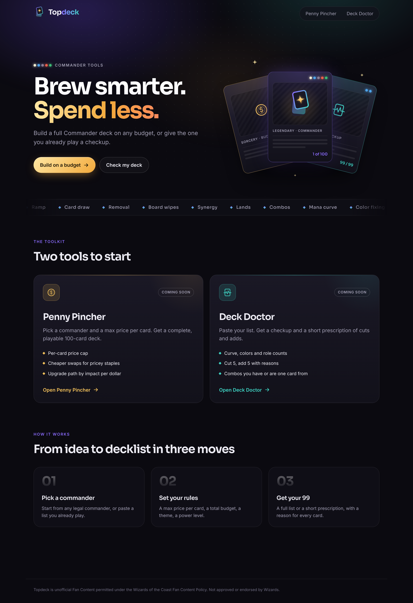

# Topdeck

Brew smarter. Spend less. A set of Magic: The Gathering Commander tools:

- **Penny Pincher**: build a full deck under a per-card price cap.
- **Deck Doctor**: paste a list, get a checkup and a short list of cuts and adds.

Both are placeholders for now; this is the app shell, brand and design system.

## Run it

```sh
npm install
npm run dev
```

`npm run build` type-checks and builds; `npm run lint` runs oxlint.

## Brand

- Name lives in `src/brand/brand.ts`.
- Logo: `src/components/Logo.tsx` (a card lifted off a deck, plus wordmark), favicon in `public/favicon.svg`.
- Fonts: Sora (display) and Inter (body), self-hosted via Fontsource.
- Design tokens (colors, type, radii, motion) are CSS variables at the top of `src/index.css`.



Topdeck is unofficial Fan Content permitted under the Wizards of the Coast Fan Content Policy. Not approved or endorsed by Wizards.
