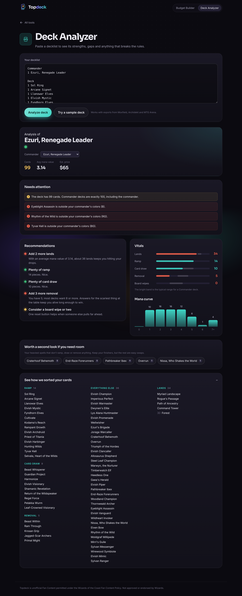

# Topdeck

Pull up a chair. Let's talk decks. A set of Magic: The Gathering Commander tools:

- **Deck Analyzer** (first version live): paste a decklist and get an analysis. It looks cards up on
  Scryfall, checks deck size, bans, color identity and duplicates, counts lands, ramp, draw,
  removal and wipes against typical ranges, draws the mana curve and color balance, and writes
  short recommendations.
- **Budget Builder** (coming soon): build a full deck under a per-card price cap.

## Stack

- **Front end:** Vite + React + TypeScript (`src/`).
- **Hosting:** Vercel. Files in `api/` are Vercel Functions; shared server code lives in `server/`.
- **Database:** Turso (libSQL). It caches Scryfall card data for a day and stores saved decks.
  The schema in `server/schema.ts` is applied automatically on first use.
- **Object storage:** Vercel Blob. Connected and checked by `/api/health`; no feature stores files yet.

| Endpoint | What it does |
| --- | --- |
| `POST /api/cards` | Looks up card names, from the Turso cache or Scryfall |
| `GET/POST/DELETE /api/decks` | Lists, saves and deletes saved decks |
| `GET /api/health` | Reports whether the database and Blob store are connected |

## Run it

```sh
npm install
npm run dev        # front end only; card lookups go straight to Scryfall
npx vercel dev     # front end plus the api/ functions (needs .env.local, see .env.example)
```

`npm run build` type-checks and builds, `npm run lint` runs oxlint, `npm test` runs the unit tests
(the server tests use an in-memory libSQL database).

## Set up hosting (one time)

1. **Vercel:** import `deasa/magic` at vercel.com/new. It detects Vite; keep the defaults.
2. **Turso:** create a database at app.turso.tech, then create a token for it. In the Vercel project,
   add `TURSO_DATABASE_URL` and `TURSO_AUTH_TOKEN` under Settings, Environment Variables.
3. **Blob:** in the Vercel project, open Storage, create a Blob store and connect it. Vercel adds
   `BLOB_READ_WRITE_TOKEN` for you.
4. Redeploy, then open `/api/health`; both entries should say `ok`.

## Brand

- Name lives in `src/brand/brand.ts`.
- Logo: `src/components/Logo.tsx` (a card lifted off a deck, plus wordmark), favicon in `public/favicon.svg`.
- Fonts: Sora (display) and Inter (body), self-hosted via Fontsource.
- Design tokens (colors, type, radii, motion) are CSS variables at the top of `src/index.css`.




Topdeck is unofficial Fan Content permitted under the Wizards of the Coast Fan Content Policy. Not approved or endorsed by Wizards.
