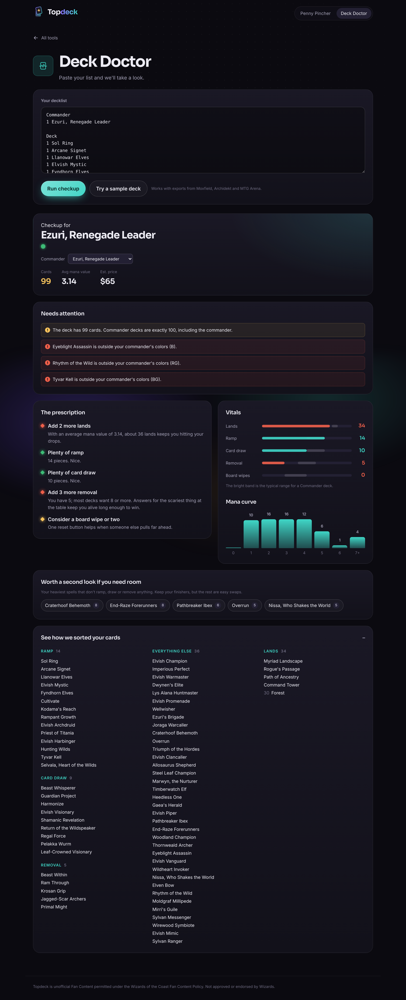

# Topdeck

Pull up a chair. Let's talk decks. A set of Magic: The Gathering Commander tools:

- **Deck Doctor** (first version live): paste a decklist and get a checkup. It looks cards up on
  Scryfall, checks deck size, bans, color identity and duplicates, counts lands, ramp, draw,
  removal and wipes against typical ranges, draws the mana curve and color balance, and writes
  a short prescription.
- **Penny Pincher** (coming soon): build a full deck under a per-card price cap.

## Run it

```sh
npm install
npm run dev
```

`npm run build` type-checks and builds, `npm run lint` runs oxlint, `npm test` runs the unit tests.

## Brand

- Name lives in `src/brand/brand.ts`.
- Logo: `src/components/Logo.tsx` (a card lifted off a deck, plus wordmark), favicon in `public/favicon.svg`.
- Fonts: Sora (display) and Inter (body), self-hosted via Fontsource.
- Design tokens (colors, type, radii, motion) are CSS variables at the top of `src/index.css`.




Topdeck is unofficial Fan Content permitted under the Wizards of the Coast Fan Content Policy. Not approved or endorsed by Wizards.
